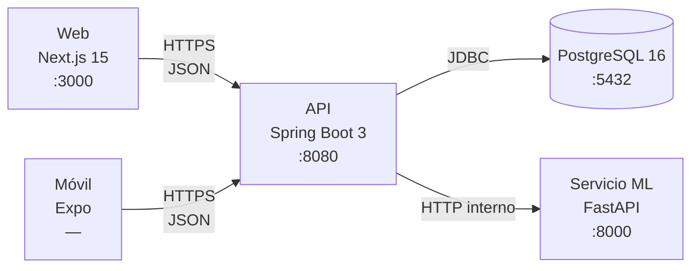
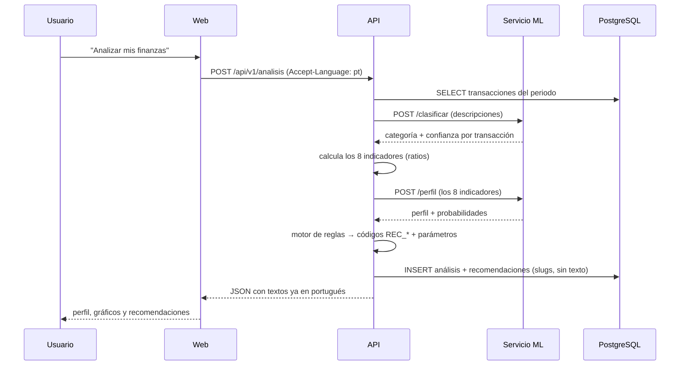
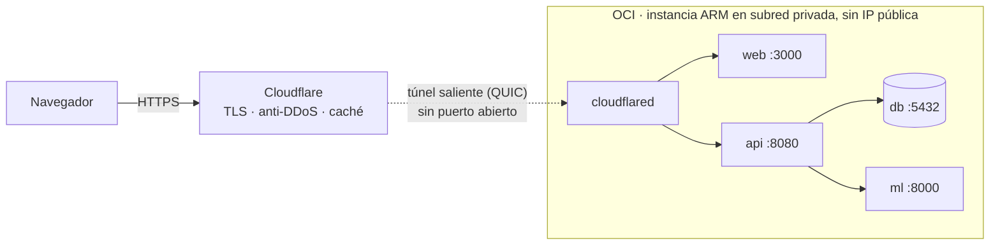

# Arquitectura

Vista de conjunto del monorepo: qué módulos hay, cómo hablan entre sí y por qué
están separados así.

> Para el detalle de cada pieza: [`../db/README.md`](../db/README.md) ·
> [`../ops/README.md`](../ops/README.md) · [`../backend/README.md`](../backend/README.md).
> El **contrato de la API** y la **taxonomía** viven en
> `docs/arquitectura/` y `docs/datos/`. La taxonomía **ya no
> está congelada**: la manda data science y la base de datos se adapta.

---

## Los cuatro servicios



| Servicio | Responsabilidad | Qué **no** hace |
|---|---|---|
| **Web / Móvil** | Presentación e interacción. Consumen la API y renderizan textos por idioma. | No calculan indicadores ni traducen slugs por su cuenta. |
| **API** | Toda la lógica de negocio: indicadores, motor de reglas, persistencia, autenticación, i18n. | No entrena ni ejecuta modelos. |
| **ML** | Inferencia pura: clasifica descripciones y predice el perfil. | No conoce usuarios, ni base de datos, ni reglas de negocio. |
| **PostgreSQL** | Estado. Esquema gobernado por migraciones versionadas. | No contiene textos de interfaz ni etiquetas traducidas. |

**Por qué el ML está separado y es tonto a propósito.** Si el servicio de
inferencia supiera de usuarios y de reglas, cada reentrenamiento sería un
despliegue de negocio y cada cambio de umbral obligaría a tocar Python. Con la
frontera donde está, el equipo de datos itera sobre el modelo y el equipo de
backend sobre las reglas, sin pisarse. El precio es un salto de red más; a esta
escala, gratis.

---

## Un análisis, paso a paso



Dos detalles que parecen menores y no lo son:

**Lo que se guarda son `codigo` + `parametros`, nunca la frase.** Si se guardara
*"Reduce tus gastos en Alimentación"*, el historial quedaría congelado en
español para siempre y un usuario brasileño vería sus análisis viejos en un
idioma que no eligió. El texto se arma **al leer**, con el idioma de ese
momento.

**El análisis guarda sus propios indicadores.** Es una foto inmutable: corregir
una categoría o reentrenar el modelo no puede reescribir un diagnóstico que ya
se le mostró a alguien. Y sin esos indicadores guardados es imposible responder
*"¿por qué este análisis dio `en_riesgo`?"* tres semanas después.

---

## Multi-idioma

El proyecto es trilingüe de verdad, no solo en la interfaz: el clasificador está
entrenado en los tres idiomas, porque si un evaluador brasileño escribe
`IFOOD *PEDIDO` y el modelo responde `otros`, la demo se cae ahí mismo.

La regla que lo sostiene:

| Se traduce ✅ | No se traduce nunca ❌ |
|---|---|
| Etiqueta del perfil (*"Em observação"*) | `perfil_codigo` (`en_observacion`) |
| Etiqueta de la categoría (*"Alimentação"*) | Las **claves** de `resumen_gastos` |
| Texto de la recomendación | `codigo` de la recomendación (`REC_DEFICIT`) |
| Mensaje de error | `codigo` de error (`VALIDACION_ENTRADA`) |

Las etiquetas viven en tablas (`categoria_i18n`, `perfil_i18n`), una fila por
idioma. Sumar un cuarto idioma es un `INSERT`, no un `ALTER TABLE` más un cambio
en la entidad, el DTO y las dos apps.

Y si llega una categoría **sin traducir**, `vw_categoria_etiqueta` cae a español
y, si tampoco está, al propio slug formateado. Nunca desaparece de la interfaz:
un dato que existe y no se ve es peor que uno sin traducir.

### Añadir un cuarto idioma

Sale barato precisamente por lo anterior. Son cuatro sitios y ninguna tabla
cambia de forma:

1. `INSERT` en `idioma`, `categoria_i18n` y `perfil_i18n`.
2. `mensajes_<idioma>.properties` en la API.
3. `frontend/web/src/messages/<idioma>.json`.
4. `frontend/mobile/src/i18n/messages/<idioma>.json`.

Ninguna consulta se toca y ninguna entidad se modifica. Si falta alguna
traducción suelta, la vista cae a español y luego al slug, así que se puede
publicar a medias e ir completando.

---

## Multi-moneda

Los indicadores son **ratios**, así que la moneda se cancela en la división: el
modelo funciona igual con pesos, reales o dólares sin reentrenar.

Para poder dividir, primero hay que sumar en la misma unidad. Todo se normaliza
a **USD** con la tasa **de la fecha del movimiento**, nunca la de hoy —
convertir un gasto de mayo con la tasa de julio es un error grande en LatAm.
`tasa_cambio` guarda una fila por moneda y día, y no sobrescribe.

> Esta regla ya evitó un bug real: `ratio_recurrente` daba **10.4** con rango
> `[0,1]` porque sumaba los gastos recurrentes en pesos y los dividía entre un
> total ya convertido a dólares.

---

## La capa de datos del frontend

Web y móvil comparten **el mismo `src/data/`**: tipos, interfaz y cliente HTTP
idénticos. Lo único que difiere es `config.ts` (`NEXT_PUBLIC_*` frente a
`EXPO_PUBLIC_*` y `localStorage` frente a `AsyncStorage`).

Las pantallas importan siempre `@/data` y nunca el cliente HTTP directamente.
Esa indirección es la que permitió **retirar la capa mock completa sin tocar ni
una pantalla**: se borró `src/data/mock/`, se quitó la rama del selector y las
dos aplicaciones siguieron compilando.

Hoy **no hay datos falsos en ningún sitio del frontend**. Si la API no responde,
la pantalla muestra el error y un botón de reintentar — que es exactamente el
comportamiento que se quiere en la entrega.

---

## Decisiones que conviene conocer

| Decisión | Dónde está el porqué |
|---|---|
| Monorepo con tres servicios | ADR-0001, ADR-0002 |
| Autenticación propia con JWT | ADR-0004 |
| Recomendaciones por reglas, **no** por LLM | ADR-0007 |
| La infraestructura nunca bloquea a la aplicación | ADR-0008 |
| Proyecto trilingüe | ADR-0009 |
| App móvil en React Native | ADR-0010 |
| Capa mock desacoplada *(ya retirada)* | ADR-0011 |
| 2FA obligatorio en el registro | ADR-0013 |
| **PostgreSQL 16 como motor** | ADR-0014 |
| Tokens de sesión en el cliente | ADR-0015 |

Todas en [`../docs/adr/`](../docs/adr/).

**Por qué reglas y no un LLM para las recomendaciones**: son auditables,
reproducibles y se pueden defender ante un jurado. *"El sistema te sugiere esto
porque tu tasa de ahorro es −0.36"* es una respuesta; *"lo dijo el modelo"* no
lo es. Además no dependen de una API externa el día de la demo.

---

## Cómo llega a producción

En local y en staging, los cuatro servicios corren en la máquina de quien
desarrolla. En **producción corren en una instancia de Oracle Cloud**:



Tres cosas que explican el montaje:

- **No hay ningún puerto abierto al exterior.** Es el servidor el que abre la
  conexión hacia Cloudflare y la mantiene. Los puertos del host solo escuchan en
  `127.0.0.1`, para depurar desde dentro de la máquina.
- **La instancia no compila nada.** Las imágenes se construyen para arm64 en la
  máquina de quien despliega, se suben a OCI Container Registry y la instancia
  se las baja. Compilar Java bajo emulación en 1 OCPU no es viable.
- **La base arranca vacía**, sin datos de ejemplo. Quien entra se registra y
  carga sus propios movimientos.

Detalle en [`../ops/DESPLIEGUE_NUBE.md`](../ops/DESPLIEGUE_NUBE.md) (llano) y
[`../ops/DESPLIEGUE_NUBE_TECNICO.md`](../ops/DESPLIEGUE_NUBE_TECNICO.md).

---

## Estado real hoy

```text
Web        ████████████████████  completa
Móvil      ████████████████████  completa
Datos      ████████████████████  esquema + migraciones + semilla
Contenedor ████████████████████  verificado en Docker y Podman
API        ████████████████████  completa para lo que consumen las interfaces
ML         ████████████████████  los dos modelos entrenados y en uso
Despliegue ████████████████████  en produccion sobre OCI
```

**La API hace un análisis financiero de punta a punta**: clasifica las
transacciones contra el servicio de modelo, calcula los 8 indicadores, predice
el perfil y genera recomendaciones con el motor de reglas, y lo persiste con su
historial. Auth con 2FA, perfil, banca, transacciones (CRUD e importación de
CSV), catálogos y producto (metas, presupuestos, eventos) están cerrados:
**ninguna pantalla recibe ya un 404**. Del contrato queda `GET /auditoria`, que
ninguna interfaz usa.

**Los dos modelos están entrenados y en uso**, con dataset propio trilingüe y
un notebook que documenta todo el proceso. M1 clasifica por el texto de la
descripción (TF-IDF de palabras + `char_wb`) y M2 predice el perfil sobre los 8
indicadores. El diseño sigue siendo *modelo primero, baseline si no está seguro*:
el clasificador por palabras clave cubre los comercios que el modelo nunca vio.
Las métricas están en [`../ml/README.md`](../ml/README.md).

El inventario completo de rutas, con la forma exacta de cada petición y cada
respuesta, está en
[`CONTRATO_API.md`](../docs/arquitectura/CONTRATO_API.md) y en el
Swagger que la propia API genera en `/api/v1/docs`.
