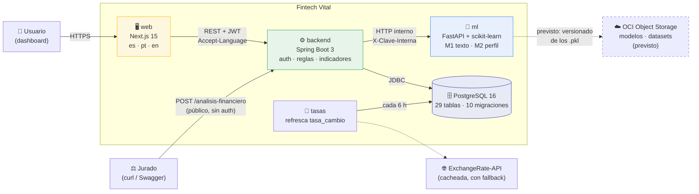
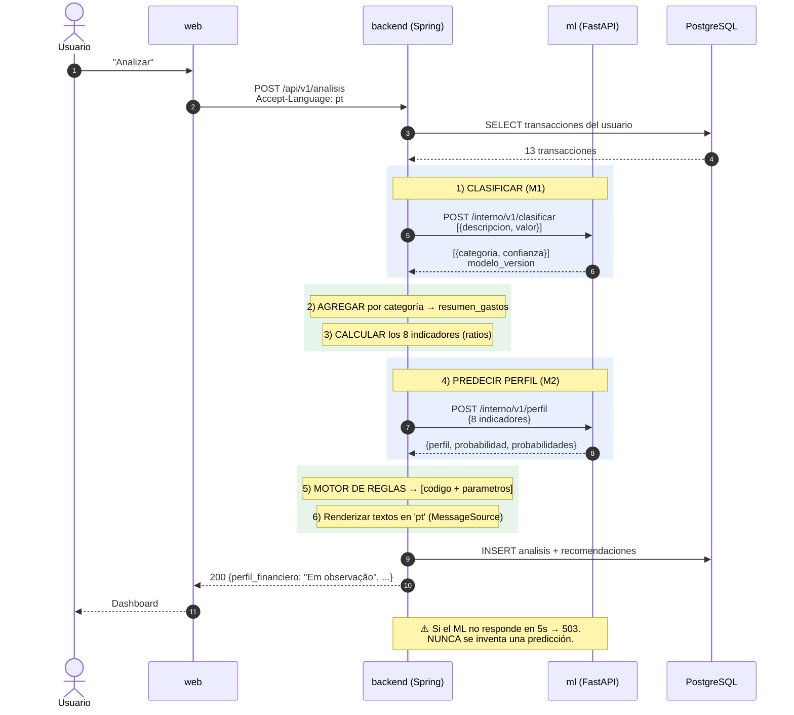
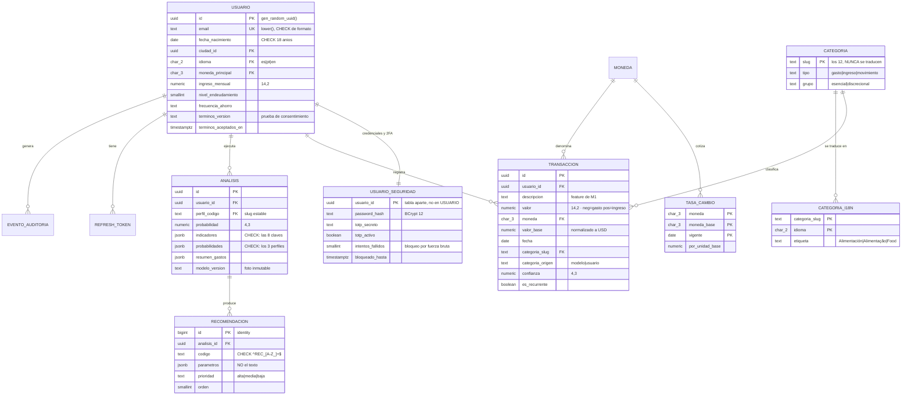
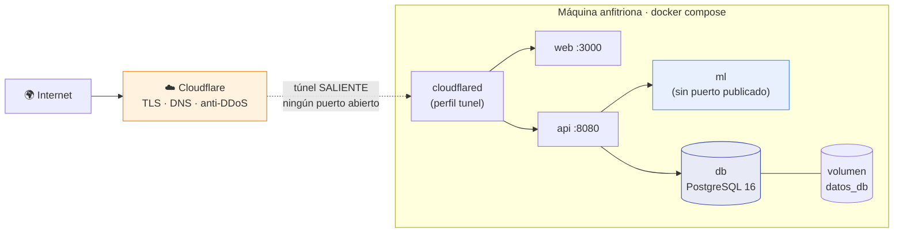
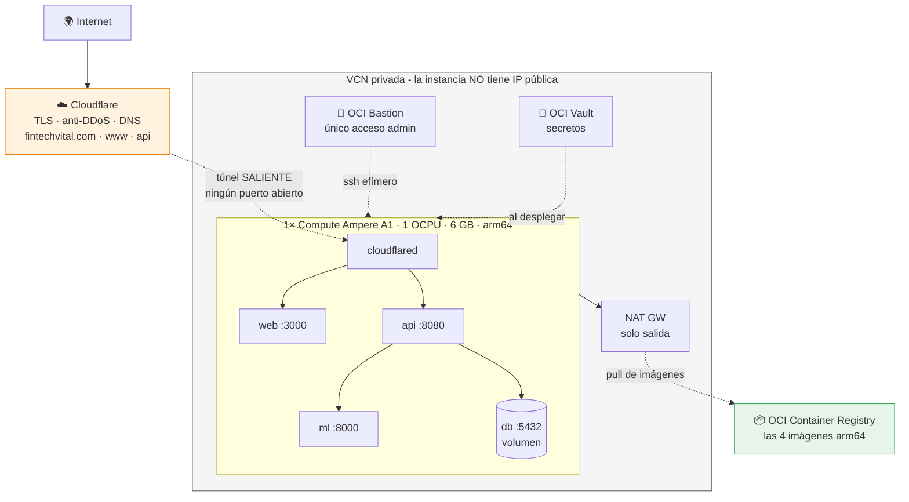
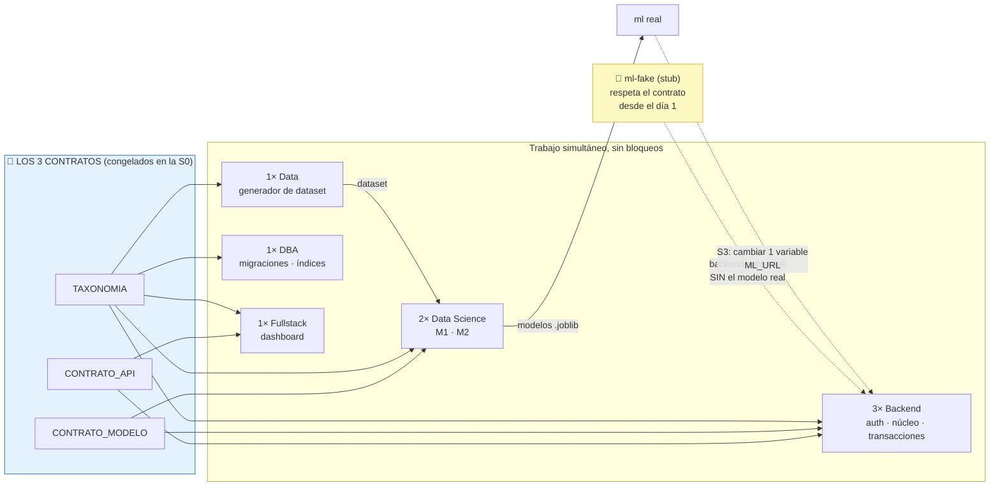

# Diagramas de arquitectura

El enunciado exige: *"La arquitectura adoptada deberá ser documentada por el equipo"*.
Este doc + [`SYSTEM_DESIGN.md`](SYSTEM_DESIGN.md) + los [ADRs](../adr/) lo cubren.

Los diagramas están en **Mermaid**: se renderizan solos en GitHub y en el `.md`, y se
versionan como texto (nada de imágenes que nadie puede editar). **Para el video y la
presentación**, se exportan a PNG.

---

## §1 Contexto - quién habla con qué



> ⚠️ **Object Storage aparece punteado porque todavía no está integrado.** Hoy los
> dos `.pkl` viajan dentro de la imagen del servicio `ml` y se cargan al arrancar.
> El bucket es el paso que cubre el requisito 7 del enunciado.

> El **jurado entra directo a la API pública**, sin pasar por el dashboard. Por eso
> ese endpoint es sagrado y no se toca.

---

## §2 El flujo del análisis - **el diagrama más importante del proyecto**

Es donde se ve la regla dura: **el ML es inferencia pura; toda la lógica de negocio
vive en Spring Boot.**



---

## §3 Modelo de datos (ER)



> **Solo las 10 tablas del núcleo del análisis.** El esquema real tiene **29**:
> banca (cuentas, tarjetas, buró), producto (metas, presupuestos, eventos),
> catálogos y auditoría. Los tipos son los de PostgreSQL 16 — `UUID` como clave,
> `JSONB` con `CHECK` sobre las claves obligatorias, `TIMESTAMPTZ`, y `NUMERIC`
> para todo lo que sea dinero. Nunca `float`.

Detalle completo en [`DATOS.md`](DATOS.md).

---

## §4 Despliegue

### §4.1 Lo que corre hoy

Un único `compose.yml` para los tres entornos; lo único que cambia es el archivo
de entorno. El túnel de Cloudflare es la **única puerta de entrada**: no se abre
ni un puerto en el router.



| Entorno | `FV_PROYECTO` | Dominio |
|---|---|---|
| local | `fintechvital` | `localhost` |
| staging | `fintechvital-staging` | `staging.fintechvital.com` |
| producción | `fintechvital-prod` | `fintechvital.com` · `www` · `api` |

`FV_PROYECTO` aísla contenedores y volumen, así que los tres pueden convivir en
la misma máquina sin pisarse.

### §4.2 Producción en OCI

> ✅ **Desplegado y en pie desde el 2026-08-20**: <https://fintechvital.com>.
> Salió **más pequeño que el plan de la S0** — una instancia en vez de cuatro y
> sin Object Storage. Procedimiento completo en
> [`../../../ops/DESPLIEGUE_NUBE_TECNICO.md`](../../ops/DESPLIEGUE_NUBE_TECNICO.md).



**Lo que hay que notar**: **ninguna flecha entra** a la VCN desde internet. El
túnel es una conexión **saliente**, y los puertos del host solo escuchan en
`127.0.0.1`. No hay Load Balancer ni hace falta
([ADR-0005](../adr/0005-infra-oci-privada.md)).

**Los servicios de OCI que se usan son cuatro**: **Compute** aloja la aplicación,
**Container Registry** guarda las imágenes `arm64`, **Vault** los secretos y
**Bastion** es el único acceso administrativo. El enunciado pedía uno.

La base de datos vive en su contenedor: Autonomous Database quedó descartada
cuando la [ADR-0014](../adr/0014-motor-postgresql.md) movió el proyecto a
PostgreSQL 16, porque las migraciones usan `JSONB`, `UUID` nativo y `pgcrypto`,
que no existen en Oracle. **Object Storage** también se planeó y no se usó: los
modelos viajan dentro de la imagen del servicio de ML.

> ⚠️ **Sin alta disponibilidad**: si la instancia cae, la aplicación cae. Es el
> intercambio aceptado para caber en el plan gratuito, y el plan B de la demo
> (grabar en local) sigue en pie.

---

## §5 Cómo trabajan en paralelo las 8 personas

El diagrama que explica por qué nadie espera a nadie.



**La idea completa en una frase**: los contratos se congelan primero, el backend
construye contra un **stub**, y el día de la integración se cambia una variable.
Si no funciona a la primera, es que alguien rompió el contrato.

> ✅ **Así fue.** El 2026-08-07 se cambió `FV_ML_URL` al servicio real y funcionó
> a la primera. El stub `ml-fake` cumplió su función y ya no está en el
> repositorio; este diagrama describe **cómo se llegó hasta aquí**, no lo que
> corre hoy.

---

## §6 Exportar para el video

Mermaid se renderiza en GitHub, pero para las slides y el video hacen falta PNG:

```bash
npm i -g @mermaid-js/mermaid-cli
mmdc -i docs/arquitectura/DIAGRAMAS.md -o docs/arquitectura/img/diagrama.png -t neutral -b transparent
```

**Para el video, usa el §1 (contexto) y el §2 (flujo del análisis).** El §4 (OCI) solo
si sobra tiempo - es el bloque que se recorta primero.
