# financeAI - frontend (web + móvil)

*(nombre provisional del proyecto - propuestas en [`docs/BRANDING.md`](docs/BRANDING.md))*

Interfaces del proyecto de **salud financiera** del Hackathon **ONE G9 - Alura +
Oracle (vía No Country)**: un dashboard web y una app móvil donde la persona ve
sus gastos clasificados automáticamente, sus indicadores, su perfil financiero
(saludable · en observación · en riesgo), recomendaciones accionables y la
evolución de sus hábitos. **Trilingüe: español · português · english.**

Esta carpeta contiene **la parte desarrollada hasta ahora: las interfaces**.
El backend (API), el modelo de ML y la base de datos los desarrolla el resto
del equipo; mientras no existen, ambas apps corren contra una **capa de datos
de demostración desacoplada** que se elimina al integrar la API real (regla del
proyecto: cero datos falsos en la demo/entrega).

## Capturas

**Dashboard web** (datos de demostración):

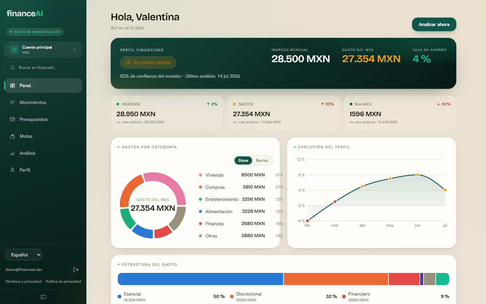

| Movimientos | Presupuestos | Metas |
|---|---|---|
| 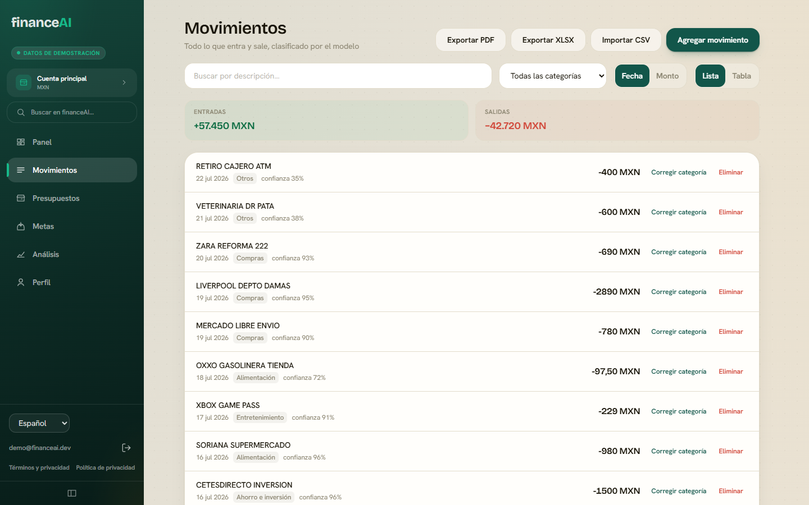 | 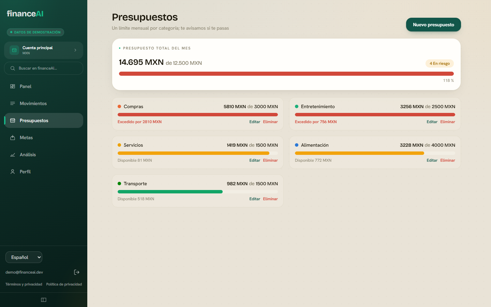 | 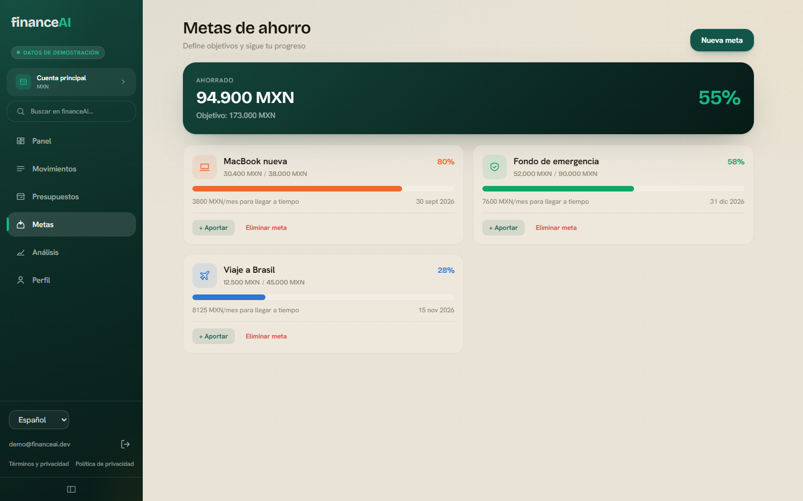 |

| Análisis | Perfil | Registro |
|---|---|---|
| 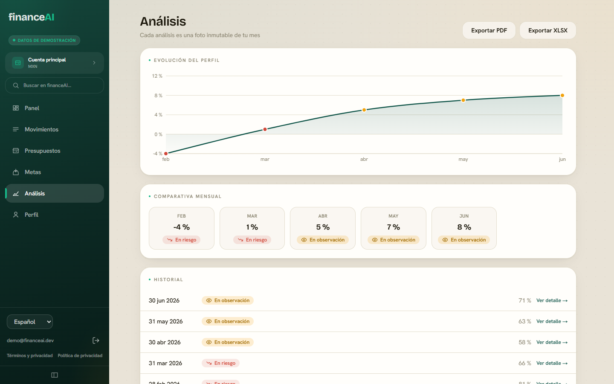 | 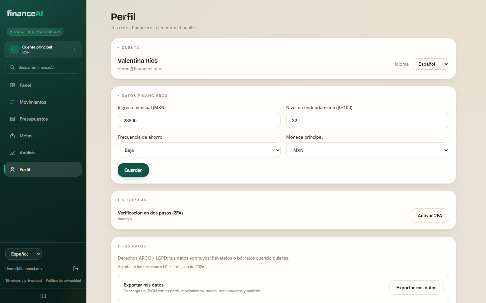 | 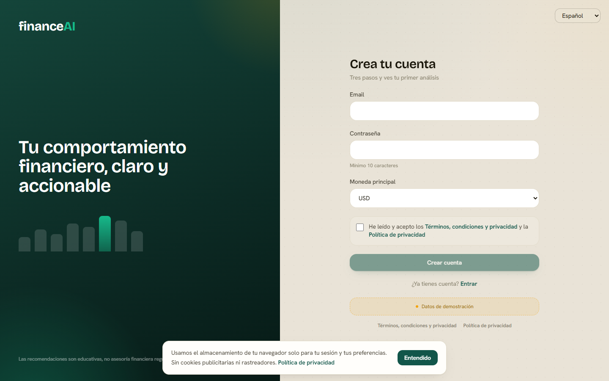 |

| Login | Painel em português |
|---|---|
| 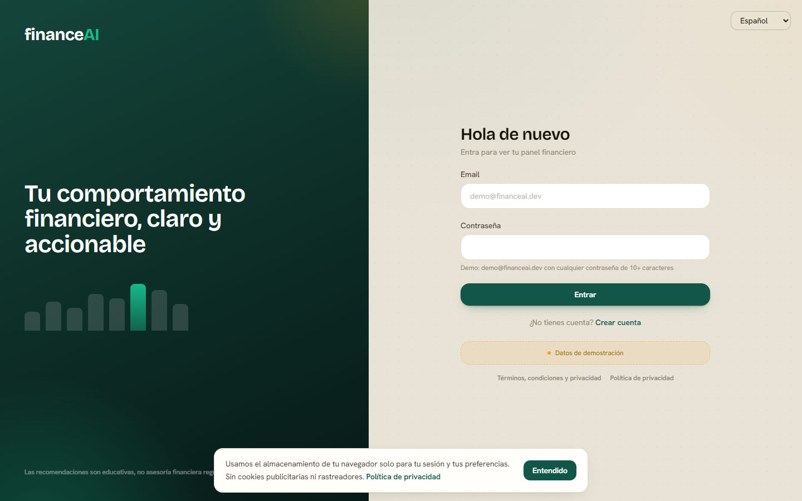 |  |

**App móvil** (Android · Expo) y la web en pantalla de teléfono:

<p>
  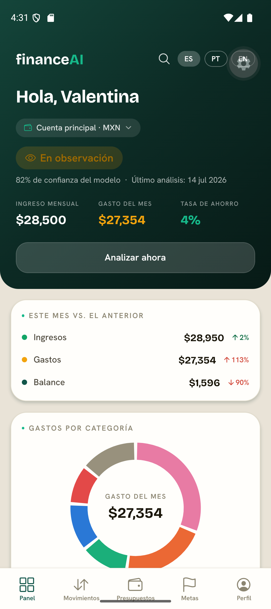
  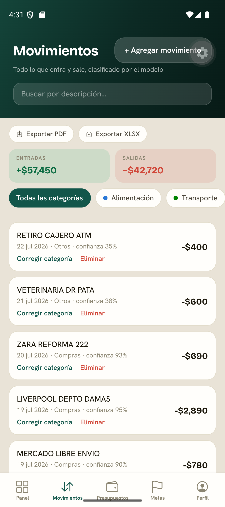
  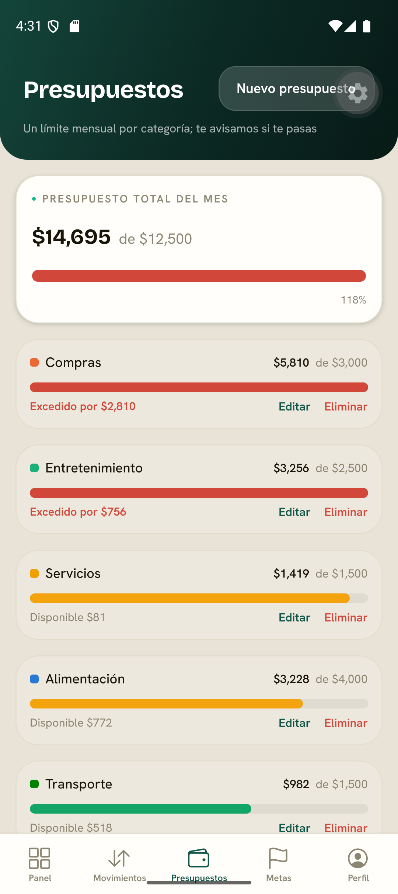
  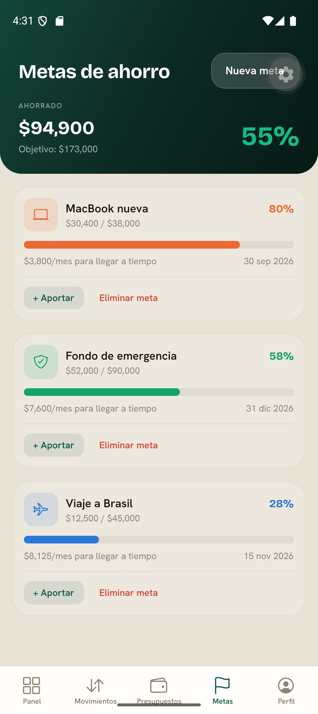
  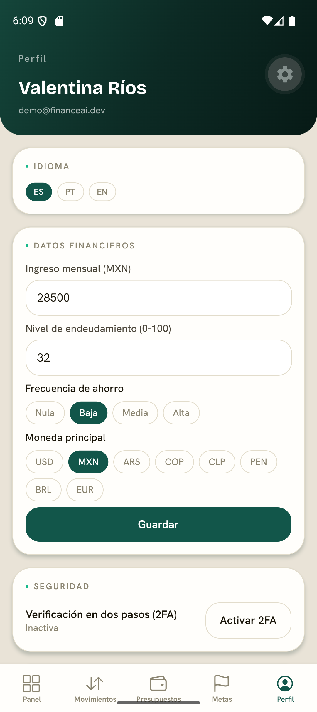
  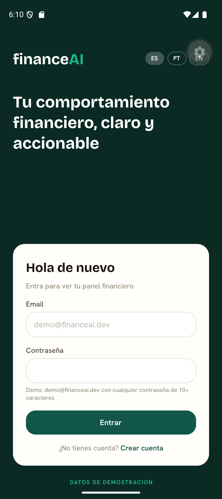
  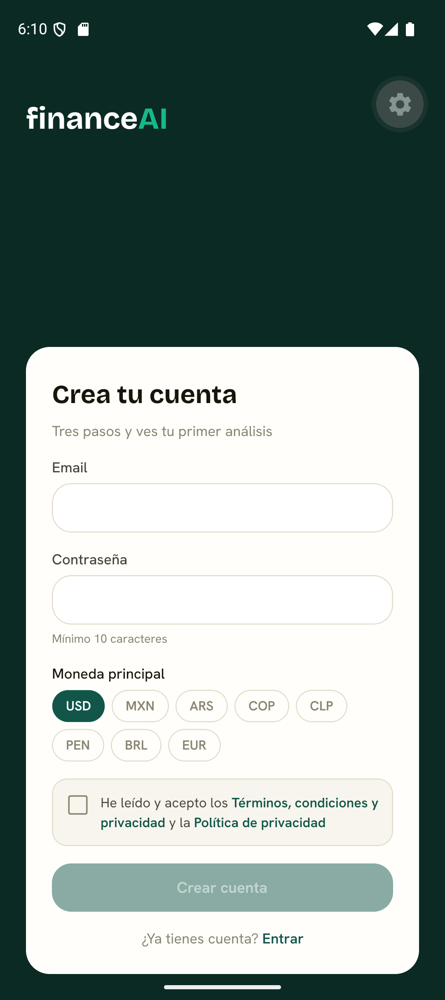
  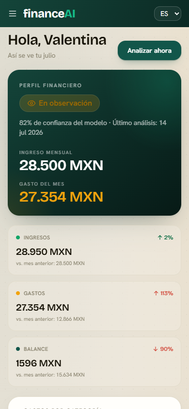
</p>

## Qué hay aquí

```text
web/         Dashboard web - Next.js 15 + TypeScript + Tailwind CSS
mobile/      App móvil - React Native + Expo SDK 57 (Expo Router)
scripts/     Menú, verificador de requisitos y utilidades por SO
             (windows/ .ps1 · linux/ · macos/ .sh)
docs/        Documentación del frontend: guía desde cero, branding,
             propuestas del equipo y entregables de No Country
\INICIAR.bat  Doble clic (Windows) → menú de desarrollo
iniciar.sh   ./iniciar.sh (Linux/macOS) → el mismo menú
```

## Qué incluyen las interfaces (web y móvil)

Registro/login con 2FA opcional · panel con perfil financiero, gastos por
categoría (dona/barras) e indicadores · movimientos con alta manual, **import
CSV** y corrección de categoría · presupuestos por categoría · metas de ahorro
· análisis con recomendaciones (y qué indicador las disparó) · **evolución
temporal** del perfil · comparación mensual · calendario de pagos ·
multi-moneda · selector de idioma · términos, privacidad y licencias
trilingües · exportación de datos y eliminación de cuenta.

## Versiones

| App | Stack |
|---|---|
| **Web** (`web/`) | Next.js **15.5.20** · React **19.1** · TypeScript **5** · Tailwind CSS **4** · next-intl **4.13** · Recharts **3.9** |
| **Móvil** (`mobile/`) | Expo **SDK 57** · React Native **0.86** · React **19.2** · Expo Router · TypeScript **6.0** |
| Requisito local | Node.js **20+** · npm |

## Cómo se corre

1. **Windows**: doble clic en `INICIAR.bat` · **Linux/macOS**: `./iniciar.sh`
2. Opción `[1]` del menú = **doctor**: revisa tu máquina y te dice qué falta.
3. Opción `[2]` levanta la web en contenedor → <http://localhost:3000>
   (o `[5]` para modo desarrollo con recarga en vivo).
4. Opción `[6]` arranca el emulador Android + Expo (o `[7]` para teléfono
   físico con Expo Go).

**Usuario demo**: `demo@financeai.dev` + cualquier contraseña de 10+
caracteres. Cualquier otro email crea una cuenta vacía.

¿Máquina sin nada instalado? Guía completa paso a paso:
[`docs/FRONTEND_DESDE_CERO.md`](docs/FRONTEND_DESDE_CERO.md).
Detalles por app: [`web/README.md`](web/README.md) ·
[`mobile/README.md`](mobile/README.md).

## De dónde salen los datos (hoy)

Las pantallas consumen **solo** la interfaz `FinanceDataSource` (`src/data/`,
idéntica en web y móvil). La implementación se elige por variable de entorno:
`mock` (default hoy) o `api` (al integrar el backend del equipo). El mock
respalda su estado en el almacenamiento del cliente, así que recargar la
página o reabrir la app **no** borra lo que cargaste. La receta para eliminar
el mock al integrar: [`web/src/data/mock/README.md`](web/src/data/mock/README.md).

## Cómo se comparte la app móvil

Para el jurado/equipo: **video demo** + **APK instalable** generado con EAS
Build (detalle en [`mobile/README.md`](mobile/README.md)). Para desarrollo:
Expo Go + QR en la misma red Wi-Fi.

## Licencia

**MIT**, a nombre del equipo (Hackathon ONE G9 - Alura + Oracle, Equipo 65).
Ver [`LICENSE`](../LICENSE) en la raíz del repositorio.
